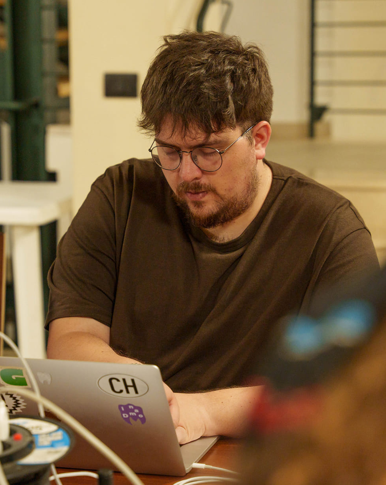

### Stefano Capezzuto
TBA

 

---

### {: width="300" style="float:left; margin-right:20px;" }

Visual, Type & Interaction Designer.
Graduated in Design at UNIRSM Design (San Marino) and later obtained a Master of Arts in Interaction Design at SUPSI (Mendrisio, Switzerland).
He is co-founder of typebreak, a reality dedicated to type design with which he gained experience in type design and had the opportunity to be a lecturer and workshop teacher at some universities such as UNIRSM Design (San Marino), IUAV (Venice) and UNICAM (Ascoli Piceno), POLIBA (Bari) as well as for other realities in various workshops dedicated to type design and visual communication.
Through the numerous professional experiences and collaborations he has expanded his activity as a designer in different areas of design, devoting himself to projects in editorial design, branding, type design, web design, UX/UI and interaction design.
Teaching collaborator at UNIRSM Design for the Web Design and Multimedia course, Member of La Scuola Open Source and based in Bari where he works as a designer at FF3300. 

**WEBSITE:**
[www.albguerra.it](https://www.albguerra.it/)

**IG:**
@albguerra

**LA SCUOLA OPEN SOURCE:**

La Scuola Open Source (SOS for short) is a working cooperative that promotes and spreads innovation, both social and technological, within a space in the Libertà  neighborhood (Bari, Italy), where it carries out its educational, cultural and research activities. The space in question, broadly defined as a “hackerspace,and is equipped with a laboratory where electronic prototyping activities are carried out that are useful for the development of the same educational and research activities, as well as the development of a community of makers in the area. 

La Scuola Open Source was founded in 2016, following the win of the national cheFare? award, as a natural continuation of a path started thanks to the funding measure for experimental teaching initiatives Laboratori dal Basso, and promoted by the Puglia Region and the Regional Technology and Innovation Agency (ARTI). 
Since its foundation, it has chosen co-design, openness, intra- and multi-disciplinarity as the levers of its actions.

Since then, SOS has activated:
- 150 laboratories/workshops;
- 100 free events for short (local) and long (online) networks;
- 10 free co-design workshops;
- 10 research projects developed.

**WEBSITE:**
[www.lascuolaopensource.xyz](https://www.lascuolaopensource.xyz/it)

**IG:**
@lascuolaopensource

 
